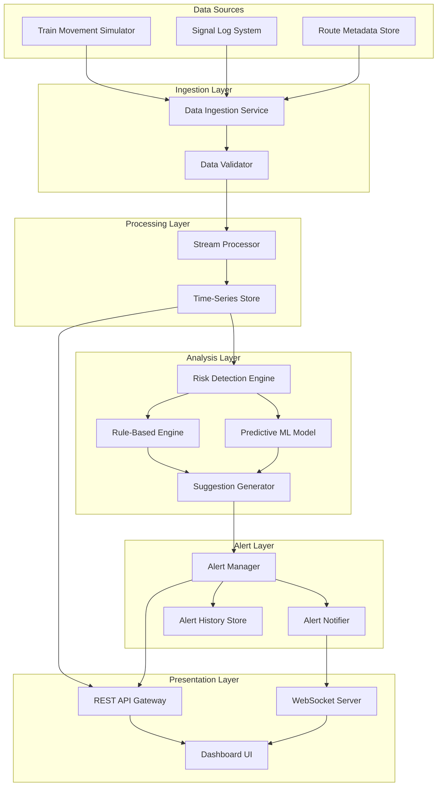

# Design Document: TRACE (Train Routing and Control Engine)

## Overview

TRACE is a cloud-native, AI-powered railway safety system designed to prevent collisions and optimize traffic flow across Indian Railways. The system combines real-time data processing, rule-based safety checks, and predictive machine learning to detect risks and provide actionable recommendations to railway operators.

The architecture follows a microservices pattern deployed on AWS, with components for data ingestion, risk analysis, alert management, and visualization. The system is designed to scale horizontally to support national-level deployment across hundreds of railway stations and thousands of trains.

### Key Design Principles

1. **Safety First**: All design decisions prioritize passenger safety and accident prevention
2. **Real-Time Performance**: Sub-second latency for critical safety alerts
3. **Scalability**: Support for 500+ concurrent trains with horizontal scaling
4. **Fault Tolerance**: Graceful degradation during partial system failures
5. **Extensibility**: Modular architecture allowing new risk detection algorithms to be added

## Architecture

The TRACE system follows a layered microservices architecture with clear separation between data ingestion, processing, analysis, and presentation layers.



### Component Responsibilities

**Data Ingestion Service**: Receives train movement data, signal logs, and route metadata from multiple sources. Handles protocol translation and initial data normalization.

**Data Validator**: Validates incoming data for completeness, format correctness, and logical consistency. Filters out malformed data and logs quality issues.

**Stream Processor**: Processes incoming data streams in real-time using Apache Kafka for message queuing and Apache Flink for stream processing. Maintains sliding windows of recent events.

**Time-Series Store**: Stores historical train positions, signal states, and system events using TimescaleDB (PostgreSQL extension) for efficient time-series queries.

**Risk Detection Engine**: Orchestrates risk analysis by coordinating rule-based checks and predictive model inference. Aggregates results and calculates overall risk scores.

**Rule-Based Engine**: Implements deterministic safety rules such as signal conflict detection, speed limit violations, and track capacity checks.

**Predictive ML Model**: Uses trained machine learning models to identify non-obvious risk patterns and predict collision probabilities based on historical data.

**Suggestion Generator**: Generates corrective action recommendations based on detected risks, considering multiple resolution strategies and ranking them by effectiveness.

**Alert Manager**: Creates, categorizes, and manages alerts throughout their lifecycle. Tracks acknowledgment and resolution status.

**Alert Notifier**: Delivers alerts to operators through multiple channels including WebSocket push notifications and the REST API.

**REST API Gateway**: Provides HTTP endpoints for dashboard queries, alert management, and system configuration.

**WebSocket Server**: Maintains persistent connections with dashboard clients for real-time updates of train positions and alerts.

**Dashboard UI**: React-based web application providing map visualization, alert lists, and system monitoring interfaces.

## Components and Interfaces

### Data Ingestion Service

**Purpose**: Receive and normalize data from multiple sources

**Interfaces**:
- `POST /ingest/train-movement`: Accept train position updates
- `POST /ingest/signal-log`: Accept signal state changes
- `POST /ingest/route-metadata`: Accept route configuration updates

**Data Models**:
```typescript
interface TrainMovement {
  trainId: string;
  timestamp: number;
  latitude: number;
  longitude: number;
  speed: number; // km/h
  heading: number; // degrees
  routeId: string;
  trackSegmentId: string;
}

interface SignalLog {
  signalId: string;
  timestamp: number;
  state: 'RED' | 'YELLOW' | 'GREEN';
  trackSegmentId: string;
  affectedTrains: string[];
}

interface RouteMetadata {
  routeId: string;
  trackSegments: TrackSegment[];
  junctions: Junction[];
  stations: Station[];
  maxCapacity: number;
}
```

### Risk Detection Engine

**Purpose**: Analyze train movements and signals to identify safety risks

**Interfaces**:
- `analyzeRisk(context: RiskContext): RiskAssessment`
- `detectSignalConflicts(signals: SignalLog[], trains: TrainMovement[]): SignalConflict[]`
- `predictCollisions(trains: TrainMovement[], routes: RouteMetadata[]): CollisionScenario[]`
- `assessRoutingRisk(route: RouteMetadata, activeTrains: TrainMovement[]): RoutingRisk`

**Data Models**:
```typescript
interface RiskContext {
  trains: TrainMovement[];
  signals: SignalLog[];
  routes: RouteMetadata[];
  timestamp: number;
}

interface RiskAssessment {
  overallRiskScore: number; // 0-100
  signalConflicts: SignalConflict[];
  collisionScenarios: CollisionScenario[];
  routingRisks: RoutingRisk[];
  networkCongestion: CongestionMetrics;
}

interface SignalConflict {
  conflictId: string;
  affectedSignals: string[];
  affectedTrains: string[];
  severity: 'LOW' | 'MEDIUM' | 'HIGH' | 'CRITICAL';
  detectedAt: number;
}

interface CollisionScenario {
  scenarioId: string;
  involvedTrains: string[];
  collisionPoint: {latitude: number, longitude: number};
  estimatedTimeToCollision: number; // seconds
  collisionProbability: number; // 0-1
  severity: 'LOW' | 'MEDIUM' | 'HIGH' | 'CRITICAL';
}

interface RoutingRisk {
  routeId: string;
  riskScore: number; // 0-100
  riskFactors: string[];
  affectedTrains: string[];
  severity: 'LOW' | 'MEDIUM' | 'HIGH' | 'CRITICAL';
}
```

### Rule-Based Engine

**Purpose**: Apply deterministic safety rules to detect violations

**Rules Implemented**:
1. **Signal Conflict Rule**: Two trains cannot receive green signals for converging track segments
2. **Speed Limit Rule**: Train speed must not exceed track segment speed limit
3. **Track Capacity Rule**: Number of trains on a segment cannot exceed capacity
4. **Minimum Separation Rule**: Trains on same track must maintain minimum distance
5. **Signal Overrun Rule**: Train must not pass a red signal

**Interface**:
```typescript
interface RuleEngine {
  evaluateRules(context: RiskContext): RuleViolation[];
  addRule(rule: SafetyRule): void;
  removeRule(ruleId: string): void;
}

interface RuleViolation {
  ruleId: string;
  ruleName: string;
  violationType: string;
  affectedEntities: string[];
  severity: 'LOW' | 'MEDIUM' | 'HIGH' | 'CRITICAL';
  detectedAt: number;
}
```

### Predictive ML Model

**Purpose**: Use machine learning to predict collision risks and identify patterns

**Model Architecture**:
- **Input Features**: Train positions, speeds, headings, signal states, track geometry, historical patterns
- **Model Type**: Gradient Boosting (XGBoost) for collision probability prediction
- **Output**: Collision probability score (0-1) and confidence interval
- **Training Data**: Historical train movement data with labeled collision events and near-misses

**Interface**:
```typescript
interface PredictiveModel {
  predictCollisionProbability(trains: TrainMovement[], timeHorizon: number): CollisionPrediction[];
  detectAnomalies(trainMovement: TrainMovement): AnomalyScore;
  updateModel(trainingData: TrainingDataset): void;
}

interface CollisionPrediction {
  trainPair: [string, string];
  probability: number; // 0-1
  confidence: number; // 0-1
  timeHorizon: number; // seconds
  features: Record<string, number>;
}
```

### Suggestion Generator

**Purpose**: Generate actionable corrective recommendations for detected risks

**Strategy Types**:
1. **Signal Adjustment**: Change signal states to prevent conflicts
2. **Speed Reduction**: Reduce train speed to increase separation
3. **Route Modification**: Reroute trains to avoid congestion
4. **Hold at Station**: Delay train departure to resolve conflicts
5. **Emergency Stop**: Immediate stop for critical collision risks

**Interface**:
```typescript
interface SuggestionGenerator {
  generateSuggestions(risk: RiskAssessment): CorrectiveSuggestion[];
  rankSuggestions(suggestions: CorrectiveSuggestion[]): CorrectiveSuggestion[];
}

interface CorrectiveSuggestion {
  suggestionId: string;
  strategyType: 'SIGNAL_ADJUSTMENT' | 'SPEED_REDUCTION' | 'ROUTE_MODIFICATION' | 'HOLD_AT_STATION' | 'EMERGENCY_STOP';
  affectedTrains: string[];
  actions: Action[];
  estimatedEffectiveness: number; // 0-1
  implementationTime: number; // seconds
  priority: number; // 1-10
}

interface Action {
  actionType: string;
  targetEntity: string;
  parameters: Record<string, any>;
  description: string;
}
```

### Alert Manager

**Purpose**: Create, track, and manage alerts throughout their lifecycle

**Interface**:
```typescript
interface AlertManager {
  createAlert(risk: SignalConflict | CollisionScenario | RoutingRisk): Alert;
  acknowledgeAlert(alertId: string, operatorId: string): void;
  resolveAlert(alertId: string, resolution: Resolution): void;
  getActiveAlerts(filters: AlertFilters): Alert[];
  getAlertHistory(startTime: number, endTime: number): Alert[];
}

interface Alert {
  alertId: string;
  alertType: 'SIGNAL_CONFLICT' | 'COLLISION_SCENARIO' | 'ROUTING_RISK' | 'NETWORK_OVERLOAD';
  severity: 'LOW' | 'MEDIUM' | 'HIGH' | 'CRITICAL';
  status: 'ACTIVE' | 'ACKNOWLEDGED' | 'RESOLVED';
  createdAt: number;
  acknowledgedAt?: number;
  resolvedAt?: number;
  affectedTrains: string[];
  riskDetails: any;
  suggestions: CorrectiveSuggestion[];
  operatorId?: string;
}
```

### Dashboard UI

**Purpose**: Provide visual interface for monitoring and control

**Key Features**:
- **Map View**: Interactive map showing train positions, track layout, and risk zones
- **Alert Panel**: Real-time list of active alerts with filtering and sorting
- **Train Details**: Detailed information panel for selected trains
- **Suggestion Panel**: Display corrective suggestions with action buttons
- **Metrics Dashboard**: System health and performance metrics
- **Historical Playback**: Replay past events for analysis

**Technology Stack**:
- React 18 with TypeScript
- Mapbox GL JS for map visualization
- WebSocket client for real-time updates
- Material-UI for component library
- Redux for state management

## Data Models

### Core Entities

**Train**:
```typescript
interface Train {
  trainId: string;
  trainNumber: string;
  trainName: string;
  currentPosition: {latitude: number, longitude: number};
  speed: number;
  heading: number;
  routeId: string;
  currentTrackSegment: string;
  status: 'RUNNING' | 'STOPPED' | 'DELAYED' | 'CONNECTION_LOST';
  lastUpdateTime: number;
}
```

**TrackSegment**:
```typescript
interface TrackSegment {
  segmentId: string;
  startPoint: {latitude: number, longitude: number};
  endPoint: {latitude: number, longitude: number};
  length: number; // meters
  maxSpeed: number; // km/h
  capacity: number; // max trains
  currentOccupancy: number;
  signalIds: string[];
}
```

**Junction**:
```typescript
interface Junction {
  junctionId: string;
  location: {latitude: number, longitude: number};
  connectedSegments: string[];
  switchStates: Record<string, 'STRAIGHT' | 'DIVERGING'>;
}
```

**Station**:
```typescript
interface Station {
  stationId: string;
  stationName: string;
  location: {latitude: number, longitude: number};
  platforms: Platform[];
  trackSegments: string[];
}
```

### Database Schema

**TimescaleDB Tables**:

```sql
-- Hypertable for train movements
CREATE TABLE train_movements (
  time TIMESTAMPTZ NOT NULL,
  train_id VARCHAR(50) NOT NULL,
  latitude DOUBLE PRECISION,
  longitude DOUBLE PRECISION,
  speed DOUBLE PRECISION,
  heading DOUBLE PRECISION,
  route_id VARCHAR(50),
  track_segment_id VARCHAR(50)
);

SELECT create_hypertable('train_movements', 'time');

-- Hypertable for signal logs
CREATE TABLE signal_logs (
  time TIMESTAMPTZ NOT NULL,
  signal_id VARCHAR(50) NOT NULL,
  state VARCHAR(10),
  track_segment_id VARCHAR(50)
);

SELECT create_hypertable('signal_logs', 'time');

-- Regular table for alerts
CREATE TABLE alerts (
  alert_id UUID PRIMARY KEY,
  alert_type VARCHAR(50),
  severity VARCHAR(20),
  status VARCHAR(20),
  created_at TIMESTAMPTZ,
  acknowledged_at TIMESTAMPTZ,
  resolved_at TIMESTAMPTZ,
  affected_trains TEXT[],
  risk_details JSONB,
  operator_id VARCHAR(50)
);

-- Regular table for route metadata
CREATE TABLE routes (
  route_id VARCHAR(50) PRIMARY KEY,
  route_name VARCHAR(200),
  track_segments JSONB,
  junctions JSONB,
  stations JSONB,
  max_capacity INTEGER
);
```

## Correctness Properties

*A property is a characteristic or behavior that should hold true across all valid executions of a system—essentially, a formal statement about what the system should do. Properties serve as the bridge between human-readable specifications and machine-verifiable correctness guarantees.*


### Property 1: Train Position Update Latency

*For any* train movement data received by the system, the train's position in the system state should be updated within 2 seconds of receipt.

**Validates: Requirements 1.1**

### Property 2: Dashboard Rendering Completeness

*For any* set of active trains, the dashboard rendering should include position, speed, and trajectory information for each train.

**Validates: Requirements 1.2**

### Property 3: Dashboard Reactivity to Status Changes

*For any* train status change, the dashboard should reflect the updated status immediately after the change is processed.

**Validates: Requirements 1.3**

### Property 4: Connection Loss Detection

*For any* train, if movement data is unavailable for more than 30 seconds, the system should flag that train with status "connection lost".

**Validates: Requirements 1.5**

### Property 5: Signal Conflict Detection Completeness

*For any* set of signal instructions where multiple trains receive conflicting signals for the same track segment, the Risk Detection Engine should identify this as a signal conflict within 1 second.

**Validates: Requirements 2.1**

### Property 6: Risk-to-Alert Severity Mapping

*For any* detected risk (signal conflict, collision scenario, routing risk, or network overload), the system should generate an alert with the correct severity level: signal conflicts → CRITICAL, high collision probability (>70%) → CRITICAL, high routing risk (score >60) → HIGH, network overload → MEDIUM.

**Validates: Requirements 2.2, 3.2, 5.3, 6.3**

### Property 7: Signal Validation on State Change

*For any* signal state change, the Risk Detection Engine should validate the change against all currently active train routes.

**Validates: Requirements 2.4**

### Property 8: Collision Probability Calculation

*For any* scenario where two or more trains are on converging paths, the Risk Detection Engine should calculate a collision probability value based on their trajectories and speeds.

**Validates: Requirements 3.1**

### Property 9: Collision Prediction Lead Time

*For any* collision scenario detected by the system, the prediction should occur at least 5 minutes before the estimated time of impact.

**Validates: Requirements 3.3**

### Property 10: Risk Calculation Factor Sensitivity

*For any* collision risk or routing risk calculation, changing the input factors (train speeds, braking distances, track geometry, track capacity, junction constraints, station dwell times) should affect the calculated risk output, proving these factors are considered.

**Validates: Requirements 3.4, 5.4**

### Property 11: Corrective Suggestion Generation

*For any* detected safety risk, the system should generate at least one corrective suggestion within 3 seconds.

**Validates: Requirements 4.1**

### Property 12: Suggestion Action Completeness

*For any* corrective suggestion generated, it should include at least one action of type: signal adjustment, speed reduction, route modification, hold at station, or emergency stop.

**Validates: Requirements 4.2**

### Property 13: Suggestion Ranking

*For any* risk scenario where multiple corrective suggestions are generated, the suggestions should be ranked (have distinct priority values) based on effectiveness and implementation time.

**Validates: Requirements 4.3**

### Property 14: Suggestion Outcome Tracking

*For any* corrective suggestion that is implemented by an operator, the system should record the implementation event and outcome in its tracking data.

**Validates: Requirements 4.5**

### Property 15: Route Conflict Analysis

*For any* new train route assignment, the Risk Detection Engine should analyze it against all currently active routes to identify potential conflicts.

**Validates: Requirements 5.1**

### Property 16: Risk Score Bounds

*For any* routing risk identified by the system, the calculated risk score should be within the range 0-100 inclusive.

**Validates: Requirements 5.2**

### Property 17: Alternative Route Suggestions

*For any* routing scenario where a high-risk route is detected (risk score > 60), the system should suggest at least one alternative route.

**Validates: Requirements 5.5**

### Property 18: Congestion Level Calculation

*For any* track segment, the system should calculate a congestion level based on the current train density and the segment's capacity.

**Validates: Requirements 6.1**

### Property 19: Congestion Trend Prediction

*For any* network state with scheduled train movements, the system should generate congestion predictions for the next 30 minutes.

**Validates: Requirements 6.5**

### Property 20: Map View Train Completeness

*For any* set of active trains, all trains should appear in the dashboard's geographical map view with their current positions.

**Validates: Requirements 7.1**

### Property 21: Alert List Sorting

*For any* set of active alerts, the dashboard list view should display them sorted first by severity (CRITICAL > HIGH > MEDIUM > LOW) and then by timestamp (newest first within each severity level).

**Validates: Requirements 7.2**

### Property 22: Alert Notification Latency

*For any* alert generated by the system, the dashboard should display a visual notification within 1 second of alert creation.

**Validates: Requirements 7.3**

### Property 23: Train Filtering and Search

*For any* search query by train ID, route, or status, the dashboard should return only trains that match the specified criteria.

**Validates: Requirements 7.4**

### Property 24: Alert Unique Identification

*For any* set of alerts generated by the system, each alert should have a unique identifier, and each should have a timestamp indicating when it was created.

**Validates: Requirements 8.1**

### Property 25: Alert Categorization

*For any* alert generated, it should be assigned to exactly one of these categories: Signal_Conflict, Collision_Scenario, Routing_Risk, or Network_Overload.

**Validates: Requirements 8.2**

### Property 26: Alert Acknowledgment State Transition

*For any* alert in ACTIVE status, when a railway operator acknowledges it, the alert status should transition to ACKNOWLEDGED.

**Validates: Requirements 8.3**

### Property 27: Alert Resolution Recording

*For any* alert that is resolved, the system should record both the resolution timestamp and the actions taken to resolve it.

**Validates: Requirements 8.5**

### Property 28: Signal Log Parsing Accuracy

*For any* batch of signal logs ingested, the parsing success rate should be at least 99.9% (error rate below 0.1%).

**Validates: Requirements 9.2**

### Property 29: Data Quality Error Handling

*For any* data input with quality issues (malformed, incomplete, or invalid), the system should log the error and continue operating with the remaining valid data.

**Validates: Requirements 9.4**

### Property 30: Risk Analysis Processing Time

*For any* risk analysis cycle across all monitored trains, the Risk Detection Engine should complete the analysis within 5 seconds.

**Validates: Requirements 10.2**

### Property 31: Alert Generation Latency Under Load

*For any* system load condition, alert generation latency should remain below 3 seconds from risk detection to alert creation.

**Validates: Requirements 10.4**

### Property 32: Safety Violation Detection

*For any* standard safety violation (signal overrun, speed limit breach, track capacity exceeded, minimum separation violated), the rule-based engine should detect and flag the violation.

**Validates: Requirements 11.1**

### Property 33: Rule Violation Alert Generation

*For any* safety violation detected by the rule-based engine, the system should generate an alert immediately (within the normal alert generation latency bounds).

**Validates: Requirements 11.3**

### Property 34: Anomaly Confidence Scoring

*For any* anomalous pattern identified by the predictive model, the Risk Detection Engine should calculate and include a confidence score with the detection.

**Validates: Requirements 11.4**

### Property 35: Risk Assessment Comprehensiveness

*For any* risk assessment produced, it should include outputs from both the rule-based engine and the predictive model (when both are operational).

**Validates: Requirements 11.5**

### Property 36: Graceful Degradation on Component Failure

*For any* non-critical component failure, the system should continue operating with reduced functionality rather than shutting down completely.

**Validates: Requirements 12.1**

### Property 37: Error Logging Completeness

*For any* error or system event that occurs, an entry should be written to the system logs with timestamp, error type, and relevant context.

**Validates: Requirements 12.2**

### Property 38: Automatic Reconnection

*For any* temporary data source connection loss, the system should automatically attempt to reconnect and resume data ingestion once the source becomes available.

**Validates: Requirements 12.4**

## Error Handling

The TRACE system implements comprehensive error handling to ensure reliability and fault tolerance:

### Data Ingestion Errors

**Malformed Data**: When data fails validation, the system logs the error with details about the malformed fields and continues processing other data. The affected train or signal is marked with a data quality warning.

**Connection Failures**: When a data source becomes unavailable, the system:
1. Logs the connection failure with timestamp
2. Marks affected entities (trains/signals) as "connection lost"
3. Attempts automatic reconnection every 30 seconds
4. Continues operating with cached data and other available sources

**Data Quality Issues**: When data quality metrics fall below thresholds:
- Parse error rate > 0.1%: Alert generated for operators
- Missing critical fields: Entity marked as incomplete, excluded from risk analysis
- Timestamp anomalies: Data rejected, logged for investigation

### Risk Detection Errors

**Model Inference Failures**: When the predictive ML model fails:
1. System falls back to rule-based detection only
2. Dashboard displays warning about degraded detection capability
3. Alert generated for system administrators
4. Model health checks continue, automatic recovery when model becomes available

**Rule Engine Errors**: When rule evaluation fails:
1. Error logged with rule ID and context
2. Other rules continue executing
3. Failed rule marked for investigation
4. Alert generated if critical rules fail

**Calculation Errors**: When risk calculations produce invalid results (NaN, infinity, out of bounds):
1. Error logged with input data
2. Conservative fallback values used (e.g., maximum risk score)
3. Alert generated for investigation

### Alert System Errors

**Alert Generation Failures**: When alert creation fails:
1. Error logged with risk details
2. Retry attempted up to 3 times
3. If all retries fail, critical error logged for manual intervention

**Notification Failures**: When dashboard notifications fail to deliver:
1. Alert persisted in database regardless
2. Retry on next WebSocket heartbeat
3. Operators can query missed alerts via API

### Database Errors

**Write Failures**: When database writes fail:
1. Data cached in memory buffer
2. Retry with exponential backoff
3. If buffer fills, oldest non-critical data discarded
4. Critical alerts always persisted (block if necessary)

**Query Failures**: When database queries fail:
1. Error returned to caller with appropriate HTTP status
2. Cached data used when available
3. Retry logic for transient failures

### Dashboard Errors

**WebSocket Disconnections**: When dashboard loses connection:
1. Client automatically attempts reconnection
2. Full state resync on reconnection
3. Missed updates retrieved via API

**Rendering Errors**: When map or UI rendering fails:
1. Error boundary catches exception
2. Fallback UI displayed
3. Error reported to monitoring system
4. User can refresh to recover

## Testing Strategy

The TRACE system employs a comprehensive testing strategy combining unit tests, property-based tests, integration tests, and load tests to ensure correctness, reliability, and performance.

### Property-Based Testing

Property-based testing is the primary method for validating the correctness properties defined in this document. We will use **fast-check** (for TypeScript/JavaScript components) and **Hypothesis** (for Python components) as our property-based testing libraries.

**Configuration**:
- Minimum 100 iterations per property test
- Each test tagged with format: `Feature: trace-railway-safety-system, Property {N}: {property title}`
- Generators for domain objects: trains, signals, routes, alerts, risks
- Shrinking enabled to find minimal failing examples

**Key Property Tests**:

1. **Latency Properties** (1, 5, 11, 22, 30, 31): Generate random inputs, measure processing time, verify within bounds
2. **Completeness Properties** (2, 7, 12, 20, 24, 37): Generate random data sets, verify all required elements present in output
3. **Correctness Properties** (6, 16, 21, 25, 26): Generate random inputs, verify outputs match expected values/states
4. **Calculation Properties** (8, 10, 18): Generate random scenarios, verify calculations produce valid results
5. **Behavior Properties** (4, 15, 17, 29, 36, 38): Generate random scenarios, verify system behaves as specified

**Example Property Test** (Property 6 - Risk-to-Alert Severity Mapping):
```typescript
// Feature: trace-railway-safety-system, Property 6: Risk-to-Alert Severity Mapping
fc.assert(
  fc.property(
    fc.oneof(
      signalConflictGenerator(),
      collisionScenarioGenerator({ probabilityMin: 0.7 }),
      routingRiskGenerator({ scoreMin: 60 }),
      networkOverloadGenerator()
    ),
    (risk) => {
      const alert = alertManager.createAlert(risk);
      
      if (risk.type === 'SIGNAL_CONFLICT') {
        expect(alert.severity).toBe('CRITICAL');
      } else if (risk.type === 'COLLISION_SCENARIO' && risk.probability > 0.7) {
        expect(alert.severity).toBe('CRITICAL');
      } else if (risk.type === 'ROUTING_RISK' && risk.score > 60) {
        expect(alert.severity).toBe('HIGH');
      } else if (risk.type === 'NETWORK_OVERLOAD') {
        expect(alert.severity).toBe('MEDIUM');
      }
    }
  ),
  { numRuns: 100 }
);
```

### Unit Testing

Unit tests complement property-based tests by focusing on specific examples, edge cases, and error conditions.

**Focus Areas**:
- Boundary conditions (e.g., exactly 100 trains, exactly 80% capacity)
- Specific error scenarios (e.g., database connection failure)
- Edge cases identified in prework (requirements 3.2, 5.3, 6.2)
- Component initialization and shutdown
- Configuration validation

**Example Unit Tests**:
- Test that exactly 100 concurrent trains can be processed (Requirement 1.4)
- Test that system displays health metrics on dashboard (Requirement 7.5)
- Test that route metadata loads correctly at startup (Requirement 9.3)
- Test that 1000 events/second can be ingested (Requirement 9.5)
- Test that 500 concurrent trains are supported (Requirement 10.1)
- Test that 5000 events/second peak load is handled (Requirement 10.3)
- Test that Risk Detection Engine unavailability shows warning (Requirement 12.3)

### Integration Testing

Integration tests verify that components work correctly together and that data flows properly through the system.

**Test Scenarios**:
1. **End-to-End Risk Detection**: Ingest train data → detect collision risk → generate alert → display on dashboard
2. **Suggestion Implementation Flow**: Detect risk → generate suggestions → operator implements → track outcome
3. **Multi-Source Data Integration**: Combine train movements, signal logs, and route metadata → produce risk assessment
4. **Alert Lifecycle**: Create alert → acknowledge → resolve → verify in history
5. **Graceful Degradation**: Simulate component failure → verify continued operation → restore component → verify recovery

### Load and Performance Testing

Load tests verify that the system meets scalability and performance requirements.

**Test Scenarios**:
1. **Concurrent Train Monitoring**: Simulate 500 concurrent trains, verify no performance degradation
2. **Peak Event Load**: Generate 5000 events/second, verify system handles load
3. **Sustained Load**: Run at 1000 events/second for 1 hour, verify stability
4. **Alert Storm**: Generate 100 simultaneous alerts, verify all processed within latency bounds
5. **Dashboard Scalability**: Connect 50 concurrent dashboard clients, verify all receive updates

**Performance Metrics**:
- Train position update latency: < 2 seconds (p99)
- Signal conflict detection: < 1 second (p99)
- Alert generation: < 3 seconds (p99)
- Dashboard notification: < 1 second (p99)
- Risk analysis cycle: < 5 seconds (p99)

### Test Environment

**Development**: Local Docker Compose setup with simulated data sources
**Staging**: AWS environment with scaled-down infrastructure and synthetic data
**Production**: Full AWS deployment with real or high-fidelity simulated data

**Test Data**:
- Synthetic train movement data generated from realistic railway network models
- Historical signal log data (anonymized if using real data)
- Route metadata for major Indian railway corridors
- Labeled collision scenarios for ML model validation

### Continuous Integration

All tests run automatically on every commit:
1. Unit tests and property-based tests (fast feedback)
2. Integration tests (on successful unit tests)
3. Load tests (nightly builds only)

**Quality Gates**:
- 90% code coverage minimum
- All property tests pass (100 iterations each)
- All unit tests pass
- All integration tests pass
- No critical security vulnerabilities
- Performance benchmarks within 10% of targets

## Deployment Architecture

The TRACE system is deployed on AWS using a microservices architecture with the following services:

### AWS Services Used

**Compute**:
- ECS Fargate for containerized microservices (Data Ingestion, Risk Detection, Alert Manager, API Gateway)
- Lambda for event-driven processing (alert notifications, data transformations)

**Data Storage**:
- RDS PostgreSQL with TimescaleDB extension for time-series data
- ElastiCache Redis for caching and real-time state
- S3 for route metadata, ML models, and log archives

**Messaging**:
- MSK (Managed Kafka) for event streaming between services
- SNS for alert notifications
- SQS for asynchronous task queues

**Networking**:
- VPC with public and private subnets
- Application Load Balancer for API Gateway
- CloudFront for dashboard static assets

**Monitoring**:
- CloudWatch for metrics, logs, and alarms
- X-Ray for distributed tracing
- Custom dashboards for operational metrics

### Scaling Strategy

**Horizontal Scaling**:
- ECS services auto-scale based on CPU and memory utilization
- Risk Detection Engine scales based on queue depth
- API Gateway scales based on request rate

**Data Partitioning**:
- Train movement data partitioned by region
- Time-series data partitioned by time (daily chunks)
- Kafka topics partitioned by train ID for parallel processing

**Caching Strategy**:
- Route metadata cached in Redis (rarely changes)
- Recent train positions cached for fast dashboard queries
- Risk assessment results cached for 10 seconds

### High Availability

**Redundancy**:
- Multi-AZ deployment for all services
- RDS with read replicas for query scaling
- MSK with replication factor 3

**Failover**:
- Automatic failover for RDS and ElastiCache
- ECS task health checks with automatic replacement
- Circuit breakers for inter-service communication

**Backup and Recovery**:
- Daily RDS snapshots with 30-day retention
- S3 versioning for route metadata and models
- Point-in-time recovery for critical data

## Security Considerations

**Authentication and Authorization**:
- Railway operators authenticate via AWS Cognito
- Role-based access control (RBAC) for different operator levels
- API Gateway with JWT token validation

**Data Protection**:
- Encryption at rest for all databases (RDS, S3)
- Encryption in transit (TLS 1.3 for all connections)
- VPC security groups restricting network access

**Audit Logging**:
- All operator actions logged to CloudWatch
- Alert acknowledgments and resolutions tracked
- System events logged for compliance

**Compliance**:
- Data residency requirements met (India region)
- Audit trails for safety-critical decisions
- Regular security assessments and penetration testing
